# OpenLANE Flow for PicoRV32A 

---

## **1. Run Synthesis for `picorv32a`**
### **Invoke OpenLANE and Run Synthesis**
```bash
# Change directory to OpenLANE flow directory
cd Desktop/work/tools/openlane_working_dir/openlane

# Alias (if needed) for docker
# alias docker='docker run -it -v $(pwd):/openLANE_flow -v $PDK_ROOT:$PDK_ROOT -e PDK_ROOT=$PDK_ROOT -u $(id -u $USER):$(id -g $USER) efabless/openlane:v0.21'
docker

./flow.tcl -interactive
package require openlane 0.9

# Prepare design
dep -design picorv32a

# Run synthesis
run_synthesis
exit
exit
```

---

## **2. Run Floorplan & View in Magic**
```bash
run_floorplan

# Navigate to floorplan outputs
cd Desktop/work/tools/openlane_working_dir/openlane/designs/picorv32a/runs/13-11_18-49/results/floorplan/

# Open in Magic
magic -T /home/vsduser/Desktop/work/tools/openlane_working_dir/pdks/sky130A/libs.tech/magic/sky130A.tech \
      lef read ../../tmp/merged.lef \
      def read picorv32a.floorplan.def &
```


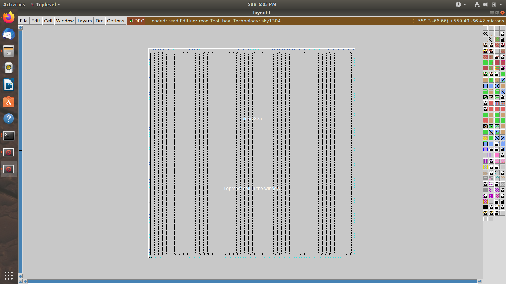

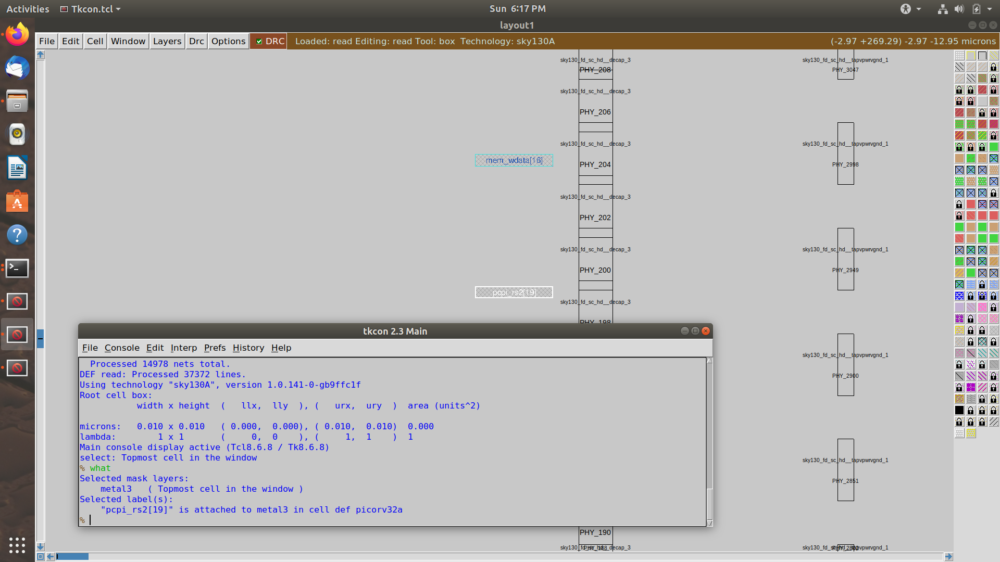

Use the **tkcon** window inside Magic to explore layout.

---

## **3. Placement Stage**
```bash
run_placement

# Navigate to placement DEF
cd Desktop/work/tools/openlane_working_dir/openlane/designs/picorv32a/runs/13-11_18-49/results/placement/

# Open placement in Magic
magic -T /home/vsduser/Desktop/work/tools/openlane_working_dir/pdks/sky130A/libs.tech/magic/sky130A.tech \
      lef read ../../tmp/merged.lef \
      def read picorv32a.placement.def &
```

---

## **4. Custom Inverter Design Flow**
```bash
cd Desktop/work/tools/openlane_working_dir/openlane

# Clone custom cell repo
git clone https://github.com/nickson-jose/vsdstdcelldesign
cd vsdstdcelldesign

# Copy Magic tech file for convenience
cp /home/vsduser/Desktop/work/tools/openlane_working_dir/pdks/sky130A/libs.tech/magic/sky130A.tech .

# Open custom inverter
magic -T sky130A.tech sky130_inv.mag &
```


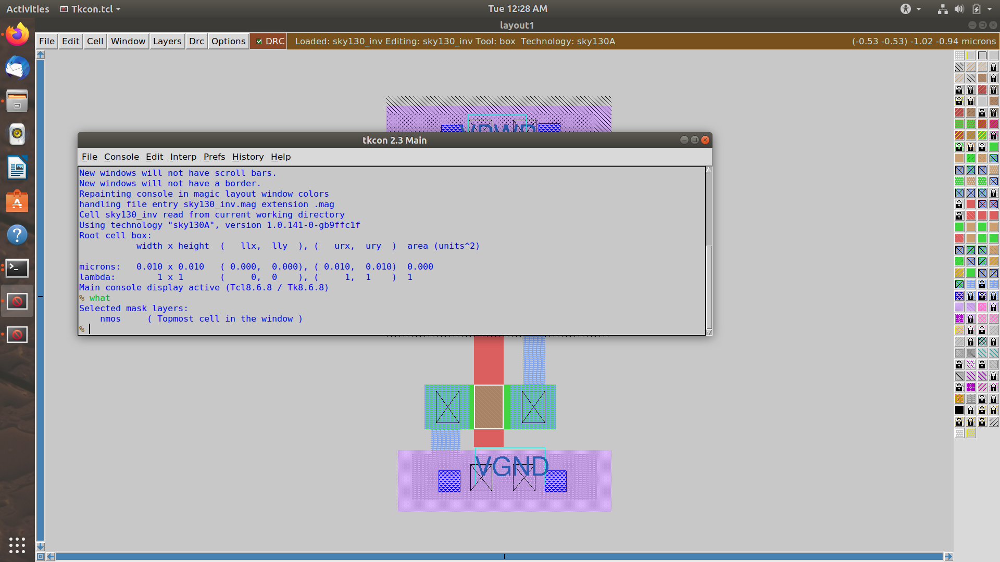

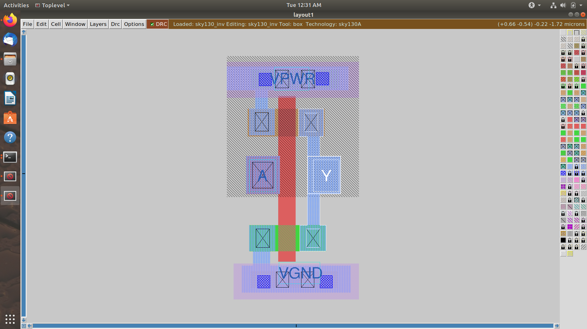


### **Extraction Commands in Magic (tkcon)**
```tcl
extract all
ext2spice cthresh 0 rthresh 0
ext2spice
```


### **DRC Rule Update Example**
Incorrect poly.9 rule implementation (spacing < 0.48u).

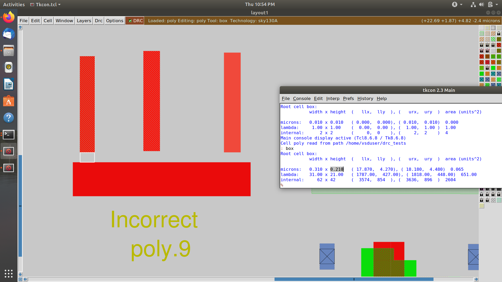
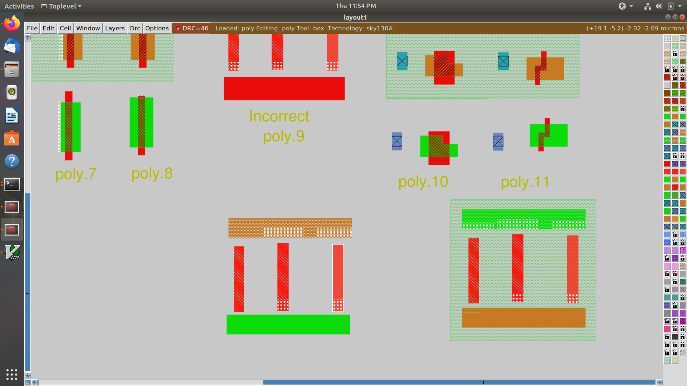

### **Reload tech & recheck DRC**
```tcl
tech load sky130A.tech
drc check
drc why
```

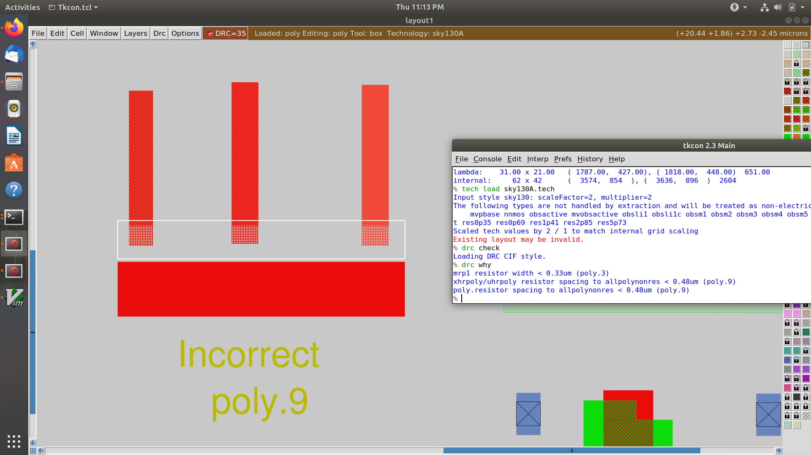
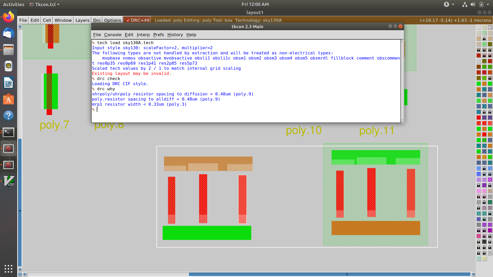
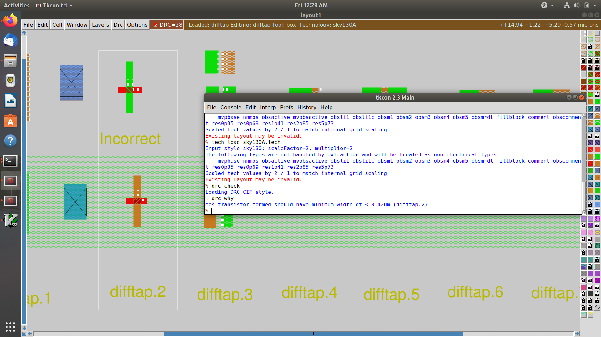

---

## **5. OpenROAD Timing Analysis (post-CTS)**
```bash
openroad
read_lef /openLANE_flow/designs/picorv32a/runs/13-11_18-49/tmp/merged.lef
read_def /openLANE_flow/designs/picorv32a/runs/13-11_18-49/results/cts/picorv32a.cts.def

write_db pico_cts.db
read_db pico_cts.db
read_verilog /openLANE_flow/designs/picorv32a/runs/13-11_18-49/results/synthesis/picorv32a.synthesis_cts.v
read_liberty $::env(LIB_SYNTH_COMPLETE)
link_design picorv32a
read_sdc /openLANE_flow/designs/picorv32a/src/my_base.sdc

set_propagated_clock [all_clocks]
report_checks -path_delay min_max -fields {slew trans net cap input_pins} -format full_clock_expanded -digits 4
exit
```

---

## **6. Power Distribution Network (PDN)**
```bash
./flow.tcl -interactive
package require openlane 0.9
prep -design picorv32a

set lefs [glob $::env(DESIGN_DIR)/src/*.lef]
add_lefs -src $lefs

set ::env(SYNTH_STRATEGY) "DELAY 3"
set ::env(SYNTH_SIZING) 1
run_synthesis

run_floorplan
run_placement

unset ::env(LIB_CTS)
run_cts

# Generate PDN
gen_pdn
```


---

## **7. Detailed Routing with TritonRoute**
```bash
echo $::env(CURRENT_DEF)
echo $::env(ROUTING_STRATEGY)
run_routing
```

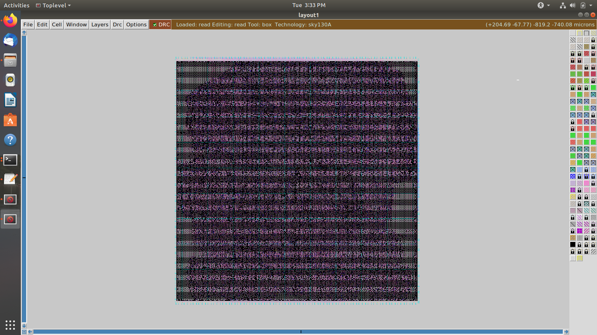
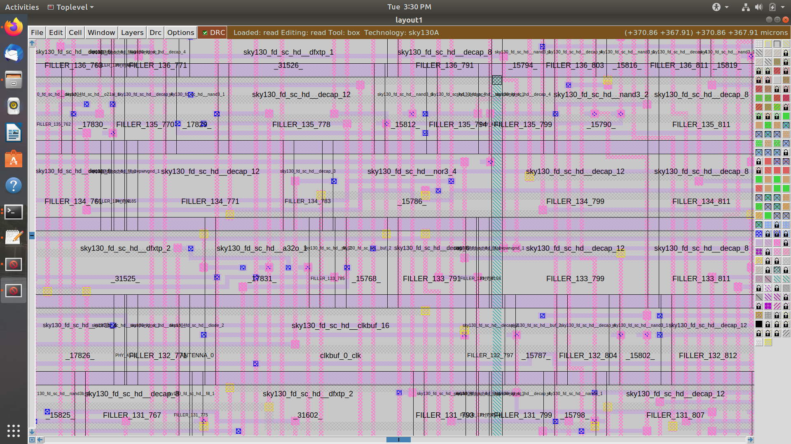
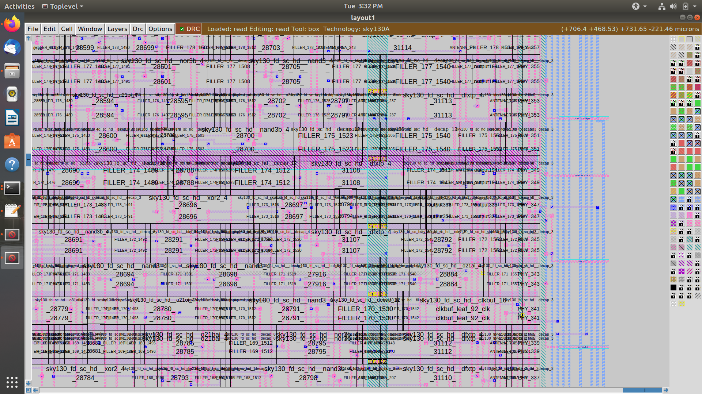

---

## **8. Post-Route SPEF Extraction**
```bash
cd Desktop/work/tools/SPEF_EXTRACTOR
python3 main.py \
  /home/vsduser/Desktop/work/tools/openlane_working_dir/openlane/designs/picorv32a/runs/13-11_18-49/tmp/merged.lef \
  /home/vsduser/Desktop/work/tools/openlane_working_dir/openlane/designs/picorv32a/runs/13-11_18-49/results/routing/picorv32a.def
```

---

## **9. Post-Route Timing Analysis With SPEF (OpenROAD)**
```bash
openroad
read_lef /openLANE_flow/designs/picorv32a/runs/13-11_18-49/tmp/merged.lef
read_def /openLANE_flow/designs/picorv32a/runs/13-11_18-49/results/routing/picorv32a.def

write_db pico_route.db
read_db pico_route.db
read_verilog /openLANE_flow/designs/picorv32a/runs/13-11_18-49/results/synthesis/picorv32a.synthesis_preroute.v
read_liberty $::env(LIB_SYNTH_COMPLETE)
link_design picorv32a
read_sdc /openLANE_flow/designs/picorv32a/src/my_base.sdc

set_propagated_clock [all_clocks]
read_spef /openLANE_flow/designs/picorv32a/runs/13-11_18-49/results/routing/picorv32a.spef

report_checks -path_delay min_max -fields {slew trans net cap input_pins} -format full_clock_expanded -digits 4
exit
```
---


